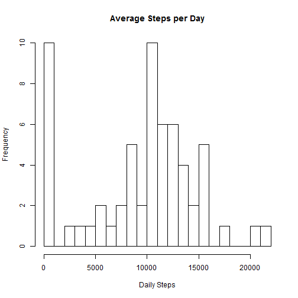
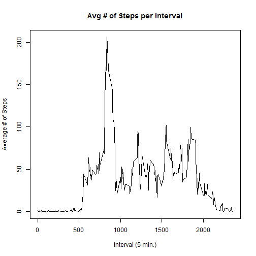
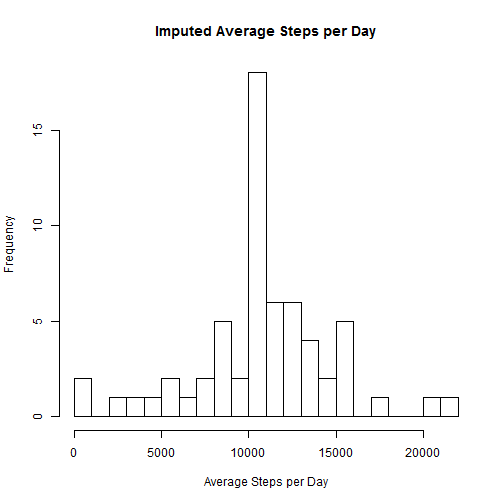
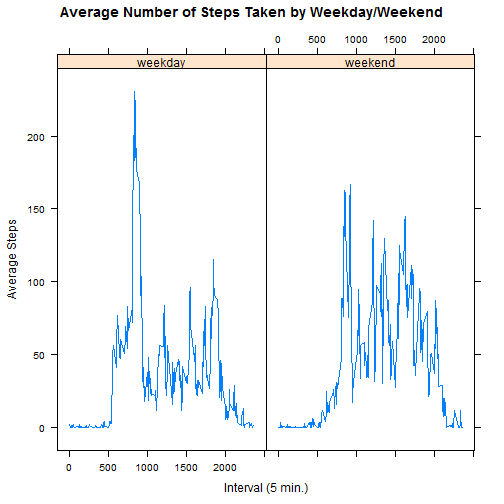

##**Overview**
This report uses data collected from personal activity devices (Fitbit, Nike Fuelband, etc..) and analyzes the step patterns of an individual collected over a 2 month period (October and November of 2012) in 5-minute intervals.  Some step data is missing for certain intervals.  This analysis will look at the impact of that missing data along with ways to impute the data from values already in the data set.


```r
#Load the data into a Data Frame
unzip("Activity.zip")
activity <- read.csv("Activity.csv")
```

###Part #1 - What is mean total number of steps taken per day?

```r
#Aggregate average number of steps by day
totalStepsPerDayRaw <-aggregate(activity$steps, by=list(activity$date), FUN=sum, na.rm=TRUE)
#Calculate simple statistics on the data (sum, average, median)
meanStepsPerDayRaw <- mean(totalStepsPerDayRaw$x)
medianStepsPerDayRaw <- summary(totalStepsPerDayRaw$x)[3]
#Display a histogram of the Average Steps per Day.  Set breaks = 20 to show differentiation
hist(totalStepsPerDayRaw$x, breaks=20, xlab="Daily Steps", main="Average Steps per Day")
```

 

Average Steps Per Day: 

```
## [1] 9354.23
```
 
Median Steps Per Day: 

```
## Median 
##  10400
```

**Part #1 Summary:**
There is significant variance in the number of steps taken daily.  The missing values cause a lot of 0-steps days which is most likely skewing the mean and median.  Additionally, the mean and median differ by 1045 steps per day, which is a significant difference.
 
###Part #2 - What is the average daily activity pattern?

```r
library(plyr)
#Aggregate activity data by interval to get average steps per interval
avgStepsPerIntervalRaw <- aggregate(activity$steps, by=list(activity$interval), FUN=mean, na.rm=TRUE)
#Cleanup field names after aggregation
avgStepsPerIntervalRaw <- rename(avgStepsPerIntervalRaw, c("Group.1"="interval","x"="AvgSteps"))
#Calculate the interval with the maximum number of steps
maxStepsInterval <- avgStepsPerIntervalRaw[which.max(avgStepsPerIntervalRaw$AvgSteps), ]
#Plot the average steps vs. interval
plot(avgStepsPerIntervalRaw$interval, avgStepsPerIntervalRaw$AvgSteps, 
     type="l", 
     xlab="Interval (5 min.)", 
     ylab="Average # of Steps", 
     main="Avg # of Steps per Interval")
```

 

5-Minute interval with the highest number of steps: 

```
##     interval AvgSteps
## 104      835 206.1698
```

**Part #2 Summary:**
It would be expected that there would be very few steps in the early hours as the individual would most-likely be sleeping.  There is a significant spike in the steps early morning then some peaks and valleys throughout the day until it tapers off towards the end of the day.  The 15 minute interval with the highest average number of steps was 835 (8:35 AM) with just over 206 steps on average.

###Part #3 - Imputing missing values

```r
library(sqldf)
```


```r
totalRows <- nrow(activity)
naRows <- sum(is.na(activity$steps))
percentNA <- naRows/totalRows

activityImputed <- sqldf('select a.date, a.interval, a.steps, i.AvgSteps
             from "avgStepsPerIntervalRaw" as i
             join "activity" as a on a.interval = i.interval')
#Any rows with a NA in the steps is replaced with the average steps for that interval over the entire data set
activityImputed$steps[is.na(activityImputed$steps)] <- activityImputed$AvgSteps[is.na(activityImputed$steps)]
#Aggregate the imputed data by steps per date (total) then calculate the median
totalStepsPerDayImputed <-aggregate(activityImputed$steps, by=list(activityImputed$date), FUN=sum, na.rm=FALSE)
medianStepsPerDayImputed <- summary(totalStepsPerDayImputed$x)[3]
#Display a histogram of the average steps per day using the imputed data
hist(totalStepsPerDayImputed$x, breaks=20, xlab="Average Steps per Day", main="Imputed Average Steps per Day")
```

 

Total Rows in Data Set: 

```
## [1] 17568
```

Rows in Data Set with NA Steps:

```
## [1] 2304
```

Average Steps Per Day (imputed data): 

```
## [1] 10766.19
```
 
Median Steps Per Day (imputed data): 

```
## Median 
##  10770
```

**Part #3 Summary:**
To account for the dates/intervals with an NA it was decided to average the steps per interval and use that average interval to fill in any NA values during the same interval.  This should yield an average inline with the expected values. This adjusted 2304 out of 17,568 rows (13.11%).  After adjustment, the average steps per day went from 9,354 to 10,766 and the median steps per day went from 10,400 to 10,770.  The mean and median steps are now much closer which would make sense since the 0-values are no longer left-skewing the data.  

### Part #4 - Are there differences in activity patterns between weekdays and weekends

```r
#Create a new column and factor the dates to "weekday" and "weekend" to fill the column
activityImputed$weektime <- as.factor(ifelse(weekdays(as.Date(activityImputed$date)) %in% 
                                    c("Saturday","Sunday"),"weekend", "weekday"))
#aggregate the data by steps per weekday/weekend and interval
avgStepsWDInterval <-aggregate(activityImputed$steps, by=list(activityImputed$interval, activityImputed$weektime), FUN=mean, na.rm=TRUE)
avgStepsWDInterval <- rename(avgStepsWDInterval, c("Group.1"="interval","Group.2"="weektime", "x"="AvgSteps"))
```


```r
library("lattice")
#plot the data for weekdays and weekends side-by-side
xyplot(AvgSteps ~ interval | factor(weektime), data=avgStepsWDInterval, 
        type = 'l',
        main="Average Number of Steps Taken by Weekday/Weekend",
        xlab="Interval (5 min.)",
        ylab="Average Steps")
```

 

**Part #4 Summary:**
Comparing the average steps per interval between weekday and weekend groups shows that the overall afternoon and evening patterns are similar while the morning pattern seems to start a bit later in the day and isn't so concentrated around a single interval.  This makes sense since during the weekday the individual most likely had to get up and be at work at a set time while on the weekend they were able to deviate from this timing.


